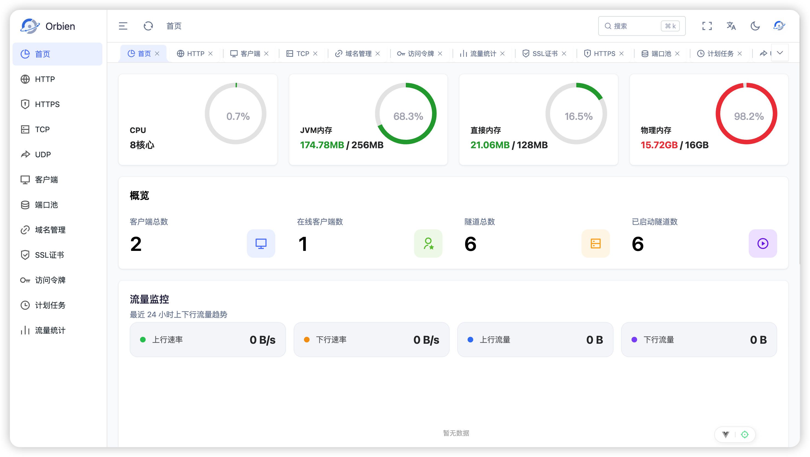

<div align="center">
  
</div>
<p align="center" style="font-size:18px;color:#555;margin-top:-10px;margin-bottom:24px;">
  一个高性能的内网穿透平台
</p>
<div align="center">
  <a href="https://github.com/lxien/orbien/stargazers">
    
  </a>
  <a href="https://github.com/lxien/orbien/forks">
    
  </a>
  <a href="https://github.com/lxien/orbien/blob/main/LICENSE">
    
  </a>
 <a href="https://github.com/lxien/orbien/releases/v0.21.0">
    
  </a>
<a href="https://somsubhra.github.io/github-release-stats/?username=lxien&repository=orbien">
  
</a>
  <a href="https://discord.gg/4dgQjCS3k">
    
  </a>
  <a href="https://stackoak.com/">
    
  </a>

</div>

<div align="center">
  <a href="README.md"><strong>README</strong></a> &nbsp;|&nbsp;
  <a href="README_ZH.md"><strong>简体中文</strong></a>
  &nbsp;|&nbsp;
  <a href="https://stackoak.com/"><strong>在线演示</strong></a>
</div>



## 一、介绍

**Orbien** 是一个基于 Netty的高性能**内网穿透平台**，支持多协议代理、多传输通道、安全鉴权与可视化运维

### 1.1 功能特性

- **代理协议**：支持TCP / UDP / HTTP / HTTPS / SOCKS5 / 文件共享等协议，且自带文件管理UI面板
- **数据传输**：TCP、WebSocket、QUIC；支持多路复用与独立连接，可选 Snappy / LZ4 / ZSTD 压缩
- **安全认证**：mTLS 双向认证、Token 身份认证、IP CIDR 访问控制、HTTP BasicAuth、时间窗口访问
- **流量管控**：带宽精细化限流、网络背压、大文件分片和流式传输
- **高可用**：轮询 / 加权 / 随机 / 最少连接多种负载均衡策略、服务健康检查
- **开发测试**：支持HTTP/HTTPS 流量抓包、Header头重写、HAProxy真实IP获取等
- **域名路由**：子域名、自定义域名，支持代理多域名；支持ACME证书签发、自动续期、一件部署等
- **运维管理**：内置现代化 Web 控制台，支持指标监控、内存监控，集中式配置管理，支持Oauth三方登陆集成等
- **配置模式**：客户端自治 + 服务端集中化配置管理，规则双向同步，满足公网和内网配置场景
- **开发集成**：二进制客户端、Spring Boot Starter 嵌入式接入
- **跨平台**：兼容 Windows、Linux、macOS（含 amd64 / arm64）

## 二、快速开始

### 2.2 服务端

需要 Linux、Docker 与公网 IP，默认使用 H2数据库。

```shell
mkdir -p /opt/orbien/data /opt/orbien/logs

cat > /opt/orbien/orbien-server.toml <<'EOF'
server_addr = "0.0.0.0"
server_port = 9527
http_proxy_port = 8080
https_proxy_port = 8443

[dashboard]
enabled = true
addr = "0.0.0.0"
port = 8020
username = "admin"
password = "123456"

[[port_pool.tcp]]
start = 9050
end = 9060

[[port_pool.udp]]
start = 9050
end = 9060
EOF

docker run -d \
  --name orbien-server \
  --restart unless-stopped \
  -p 8080:8080 \
  -p 8443:8443 \
  -p 8020:8020 \
  -p 9527:9527 \
  -p 9050-9060:9050-9060 \
  -p 9050-9060:9050-9060/udp \
  -e SPRING_PROFILES_ACTIVE=h2 \
  -e H2_DATA_DIR=/app/data/orbien-server \
  -e JAVA_OPTS="-Xms512m -Xmx512m -XX:MaxDirectMemorySize=512m -XX:+UseG1GC --enable-native-access=ALL-UNNAMED" \
  -e TZ=Asia/Shanghai \
  -v /opt/orbien/orbien-server.toml:/app/orbien-server.toml:ro \
  -v /opt/orbien/data:/app/data \
  -v /opt/orbien/cert:/app/cert \
  -v /opt/orbien/config:/app/config \
  lxien/orbien-server:0.21.0
```

| 项目   | 说明                                                             |
|------|----------------------------------------------------------------|
| 面板   | `http://<host>:8020`（`admin` / `123456`）                       |
| 数据目录 | `/opt/orbien`                                                  |
| 端口   | 隧道 `9527` · HTTP `8080` · HTTPS `8443` · TCP/UDP 池 `9050-9060` |

### 2.3 客户端

#### 2.3.1 二进制

从 [Releases](https://github.com/lxien/orbien/releases) 下载。

```shell
Usage: orbien [-hV] [-c=<configFile>] [COMMAND]
Orbien 内网穿透客户端
  -c=<configFile>    配置文件路径
  -h, --help         Show this help message and exit.
  -V, --version      Print version information and exit.
Commands:
  login   保存服务端凭据
  logout  清除本地凭据
  run     根据配置文件启动客户端
  http    启动 HTTP 代理
  tcp     启动 TCP 代理
  udp     启动 UDP 代理
```

案例：

```shell
orbien login --server <server-host>:9527 --token <access-token>
orbien http 8080
orbien tcp 3306
```

#### 2.3.2 Docker

```shell
mkdir -p /path/to/orbien/logs

cat > /path/to/orbien/orbien.toml <<'EOF'
server_addr = "<server-host>"
server_port = 9527

[auth]
token = "<access-token>"

EOF

docker run -d \
  --name orbien \
  --restart unless-stopped \
  --network host \
  -e TZ=Asia/Shanghai \
  -v /path/to/orbien/orbien.toml:/app/orbien.toml:ro \
  -v /path/to/orbien/logs:/app/logs \
  lxien/orbien:0.21.0
```

#### 2.3.3 Spring Boot Starter

```xml

<dependency>
    <groupId>io.github.lxien</groupId>
    <artifactId>orbien-spring-boot-starter</artifactId>
    <version>0.3.1</version>
</dependency>
```

```yaml
orbien:
  client:
    enabled: true
    server-addr: <server-host>
    auth:
      token: <access-token>
    proxy:
      protocol: http
```

## 问题反馈

- Issues：[github.com/lxien/orbien/issues](https://github.com/lxien/orbien/issues)
